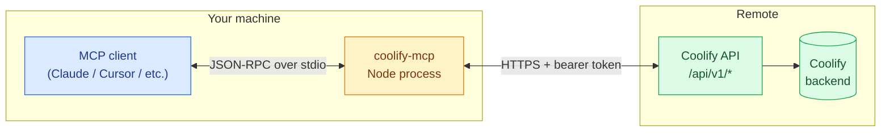
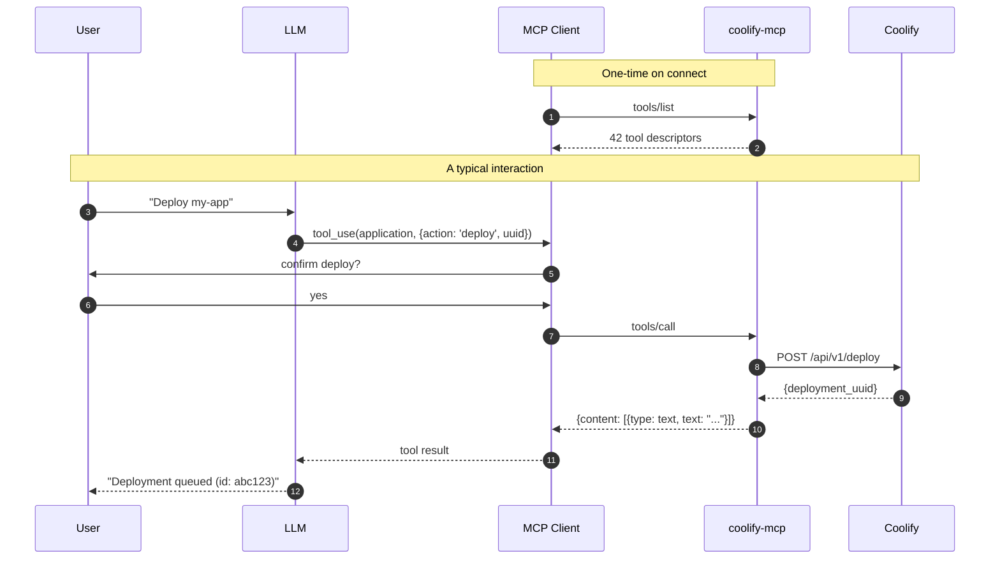
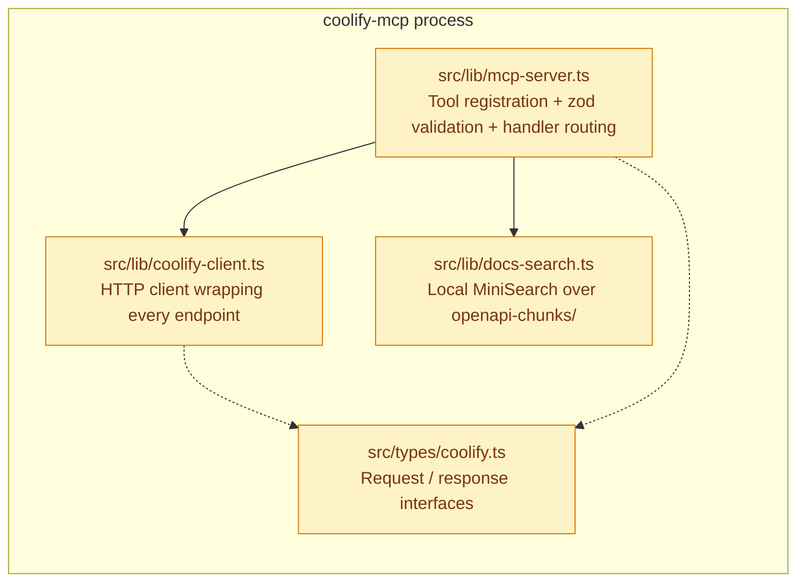
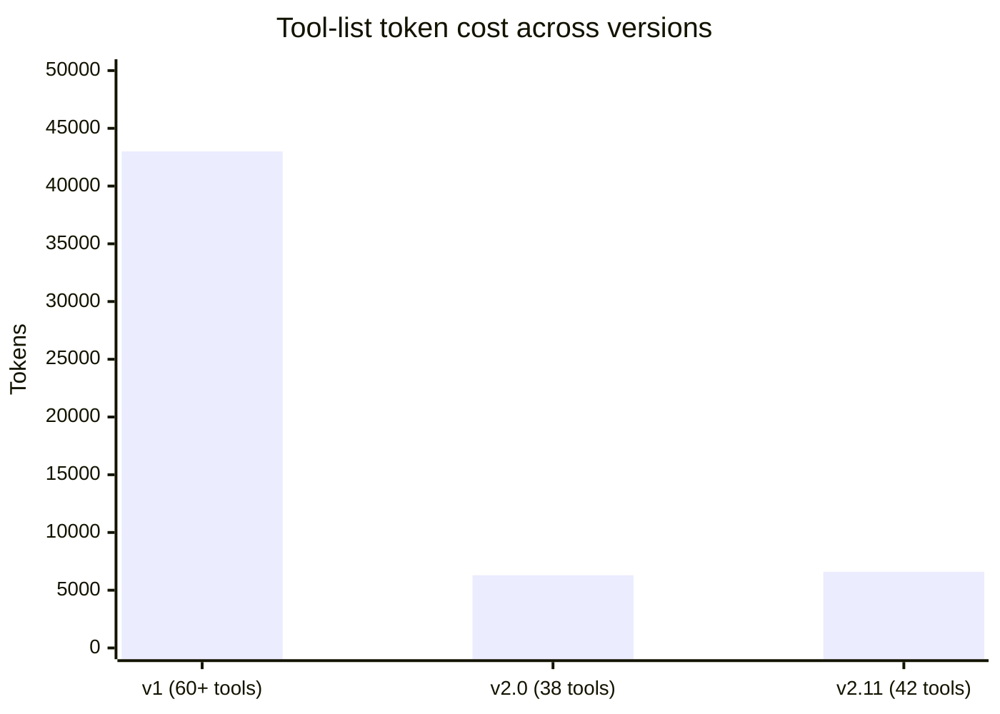
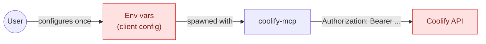

# How coolify-mcp works

A single Node process, talking JSON-RPC over stdio to the MCP client on one side and HTTPS to your Coolify on the other. No daemon, no database, no state — the process exits when the client disconnects.

## Architecture at a glance



## What happens when the model calls a tool



## File structure

```text
src/
├── index.ts                    # entry point — parses env, starts the MCP server over stdio
├── lib/
│   ├── coolify-client.ts       # HTTP client wrapping Coolify's REST API
│   ├── mcp-server.ts           # MCP tool definitions and handlers
│   └── docs-search.ts          # local MiniSearch index over docs/openapi-chunks/
├── types/
│   └── coolify.ts              # all Coolify API type definitions
└── __tests__/
    ├── coolify-client.test.ts  # mocked HTTP tests for the client
    ├── mcp-server.test.ts      # method-existence + handler tests
    └── integration/            # smoke tests against a live Coolify (opt-in)

docs/
└── openapi-chunks/             # Coolify OpenAPI spec split for token-efficient search

site/                           # this documentation site (VitePress)
```

## Layered responsibilities



Each layer has one job:

- **`mcp-server.ts`** — turn MCP tool calls into client-method calls. Zod validation lives here. No HTTP.
- **`coolify-client.ts`** — every method maps to exactly one Coolify endpoint (with the occasional defensive parse). No MCP knowledge.
- **`types/coolify.ts`** — request/response shapes, used by both layers.
- **`docs-search.ts`** — local search index over the chunked OpenAPI, so the model can answer "what fields does X accept?" without external network calls.

## Consolidation pattern (v2.0 onwards)

v1 had separate `list_servers`, `get_server`, `create_server`, `delete_server` tools. v2.0 collapsed each entity's CRUD onto a single tool with an `action` enum:

```typescript
this.tool(
  'application',
  'Application CRUD + lifecycle',
  {
    action: z.enum(['list', 'get', 'create', 'update', 'delete', 'deploy', ...]),
    uuid: z.string().optional(),
    // ... other action-specific args
  },
  async ({ action, ...args }) => {
    switch (action) {
      case 'list': return wrap(() => this.client.listApplications());
      case 'get':  return wrap(() => this.client.getApplication(args.uuid!));
      // ...
    }
  },
);
```

That cut tool count from 60+ to 42 today, dropping the LLM's tool-list token cost from ~43k to ~6.6k — roughly an 85% reduction.



## Smart diagnostic tools

Some tools aggregate across multiple endpoints to answer high-level questions in a single call:

| Tool                          | Aggregates                                                | Why it exists                                                           |
| ----------------------------- | --------------------------------------------------------- | ----------------------------------------------------------------------- |
| `diagnose_app`                | app config + recent deployments + logs + env-var metadata | Lets the LLM answer "why is this broken?" without 5 separate tool calls |
| `diagnose_server`             | server status + resource usage + hosted apps' health      | Same shape for server-level issues                                      |
| `find_issues`                 | the whole infrastructure                                  | "Show me everything that's broken right now"                            |
| `get_infrastructure_overview` | compact map of every server/project/app                   | Cheap, always-safe context primer                                       |

These exist because the alternative — the LLM stitching 4–8 calls together — is brittle and wastes tokens.

## Context optimization

List endpoints return _summaries_ (uuid + name + status), not full objects:

| Endpoint                     | Default response                      | Full response                             |
| ---------------------------- | ------------------------------------- | ----------------------------------------- |
| `list_applications`          | `~200 bytes/app` (uuid, name, status) | `get_application(uuid)` for `~3KB`        |
| `list_for_app` (deployments) | `DeploymentEssential[]` (no logs)     | `include_logs: true` for raw build output |

A 35-deployment list shrinks from ~1MB to ~4KB this way.

## Security model



- **Tokens never leave the client's machine.** They're passed as env vars to the MCP process, which adds them to `Authorization` headers on outbound requests.
- **Env var values are masked by default** on `env_vars list` responses (since v2.9.0). The MCP client / LLM sees `***` instead of the plaintext value. Opt in with `reveal: true` when you need the actual value.
- **`bulk_env_update` doesn't echo values back** — it returns a per-app success/failure summary only.
- **No write tools auto-confirm.** Destructive operations rely on the MCP client's confirmation UI. v3 will add `destructiveHint` annotations so clients can prompt more aggressively — see the [v3 vision](/roadmap/v3-vision).

See [Coolify API gotchas](/concepts/coolify-api-gotchas) for the unhappy surprises we've documented while building this.
