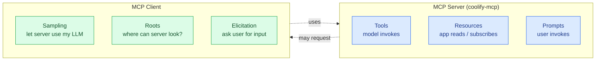
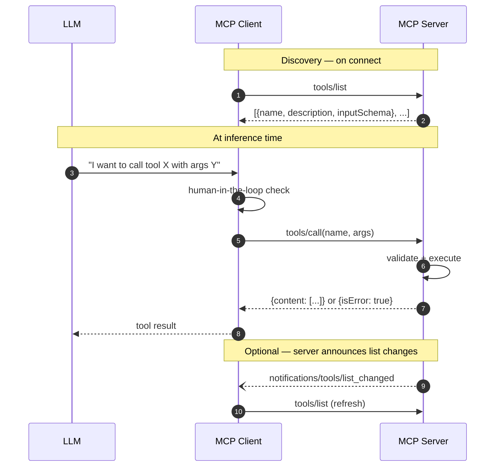

# MCP primer

A short orientation for contributors new to the [Model Context Protocol](https://modelcontextprotocol.io). Not a replacement for the spec — just enough context to read the codebase.

## What MCP is, in one paragraph

MCP is a JSON-RPC protocol that lets an AI client (Claude Desktop, Cursor, Claude Code, Continue, etc.) talk to a _server_ that exposes capabilities. The capabilities are organised into a few primitive types: **tools** (functions the model calls), **resources** (data the application can read), **prompts** (templated workflows users invoke), plus client-offered capabilities (sampling, roots, elicitation). The protocol is transport-agnostic — most servers today run over stdio (the client spawns the server process), but HTTP+SSE and streamable-HTTP transports also exist.

## The primitive types

## Control hierarchy

MCP draws a clean distinction about _who controls invocation_:

| Primitive     | Controlled by | Example                                        |
| ------------- | ------------- | ---------------------------------------------- |
| **Prompts**   | User          | Slash commands, menu picks                     |
| **Resources** | Application   | File contents, git history attached to context |
| **Tools**     | Model         | API calls the LLM decides to make              |

This is why tools have safety affordances (annotations, output schemas, error semantics) — the model is autonomously choosing to call them.

## What coolify-mcp uses today

**Tools only.** All 42 entry points are MCP tools registered via `this.tool(name, description, schema, handler)`. No resources, no prompts, no annotations, no structured outputs.

That worked well for v1 / v2 but leaves things on the table:

- The client has no way to know which tools are destructive vs read-only
- The model gets text blobs back from `list_*` instead of typed objects (harder to chain into `get_*` calls)
- Long-running ops like `deploy` block the whole MCP transaction for minutes
- There's no way for the client to _subscribe_ to a Coolify entity and get pushed updates

See the [v3 vision](/roadmap/v3-vision) for the plan to address all of this.

## How a tool call flows

The server doesn't see the user's prompt — it only sees the tool calls. That's a security boundary: **the model decides what tools to call, the client decides whether to allow it, the server executes.**

## Error semantics

MCP draws a careful line between two error types:

| Type                     | Where                       | When                                               | Why it matters                                                                            |
| ------------------------ | --------------------------- | -------------------------------------------------- | ----------------------------------------------------------------------------------------- |
| **Protocol error**       | JSON-RPC `error` field      | Unknown tool, malformed request                    | Returned to the client, NOT the LLM. Model can't self-correct.                            |
| **Tool execution error** | Result with `isError: true` | Validation failure, API down, business-logic error | Returned to the LLM. Model can read the error message and retry with adjusted parameters. |

Most things you'd want to communicate ("missing required field", "Coolify returned 404", "deployment timed out") should be tool execution errors, not protocol errors.

## Useful links

- [MCP specification — current version](https://modelcontextprotocol.io/specification/2025-11-25)
- [Tools spec — annotations, outputSchema, errors](https://modelcontextprotocol.io/specification/2025-11-25/server/tools)
- [Resources spec](https://modelcontextprotocol.io/specification/2025-11-25/server/resources)
- [Prompts spec](https://modelcontextprotocol.io/specification/2025-11-25/server/prompts)
- [TypeScript SDK on GitHub](https://github.com/modelcontextprotocol/typescript-sdk)
- [2026 MCP roadmap](https://blog.modelcontextprotocol.io/posts/2026-mcp-roadmap/)
