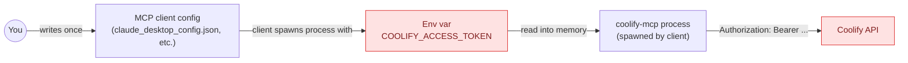

# Security model

coolify-mcp brokers credentials for your self-hosted infrastructure. This page documents what it does with those credentials, what it does not do, and what to do if something goes wrong.

If you find a vulnerability, please report it privately via [GitHub Security Advisories](https://github.com/StuMason/coolify-mcp/security/advisories/new) — not in a public issue.

## What the server is, and what it is not

|                  | What coolify-mcp **does**                                                                          | What it **does not do**                                                                      |
| ---------------- | -------------------------------------------------------------------------------------------------- | -------------------------------------------------------------------------------------------- |
| Credentials      | Reads `COOLIFY_ACCESS_TOKEN` from environment, adds it to outbound `Authorization: Bearer` headers | Persist the token to disk, log it, or transmit it anywhere except the configured Coolify URL |
| Network          | Talks JSON-RPC over stdio to one MCP client; HTTPS to one Coolify instance                         | Open inbound ports, run a daemon, accept connections from anywhere else                      |
| State            | None                                                                                               | Cache, store, or aggregate any data between sessions                                         |
| Process lifetime | Spawned per-session by the MCP client, exits on disconnect                                         | Run continuously, on a schedule, or as a background daemon                                   |

## Where the token lives

The token lives in three places: your MCP client config file on disk, the environment of the `coolify-mcp` process while it runs, and the `Authorization` header of each outbound request. It does not live anywhere else.

## What gets logged

Nothing by the MCP server. The server has no log output of its own beyond MCP protocol messages on stdio, which the client (Claude Desktop, Cursor, etc.) handles per its own logging policy.

Coolify's API may log incoming requests on its side. That is outside the MCP server's control. If you are concerned about logging, check your Coolify instance's reverse proxy and application log retention settings.

## Env var values are masked by default

Since v2.9.0, the `env_vars list` action replaces the plaintext `value` and `real_value` of every variable with `***` before returning to the MCP client. The MCP client and the LLM never see the plaintext secret unless the caller explicitly opts in.

To get the real value, pass `reveal: true` on the list call. Most use cases never need this — operations like updating, deleting, or copying a variable across apps can be done with the `uuid` and `key` alone. Reveal is for the rare case where the user asks a direct question like _"what is FOO set to right now?"_.

`bulk_env_update` does not return values at all — only a per-app success or failure summary.

## What custom HTTP headers do and do not filter

The `--header` CLI flag (added in v2.8.1) lets you inject extra headers on every outbound request, useful for Coolify instances behind Cloudflare Zero Trust, custom auth proxies, or other middleware.

Two header names are filtered with a warning to prevent silent override of the Coolify bearer token:

- `Authorization`
- `Content-Type`

All other header names pass through as-is. If you set `--header "X-Custom: ..."` you should treat that header content with the same care as the token.

## Threat model

### What the MCP client can see

- Tool descriptors (names, descriptions, input schemas) — these are part of the protocol surface
- Tool responses — including any data Coolify returns

### What the MCP client cannot see

- The `COOLIFY_ACCESS_TOKEN` value itself
- Other env vars that were not explicitly fetched via `env_vars` with `reveal: true`
- The contents of your Coolify database, deployment logs, or build artifacts unless the LLM requests them via a tool call

### What the LLM can do with the tools

Every state-changing tool (`deploy`, `update`, `delete`, `restart`, `stop_all_apps`, etc.) can be invoked by the LLM without your confirmation if your MCP client allows it. **Always run your MCP client in a mode that requires per-call confirmation for destructive operations.** Claude Desktop, Claude Code, and Cursor all support this; consult your client's documentation.

v3 will add `destructiveHint` / `readOnlyHint` annotations to every tool so clients can prompt confirmation more aggressively. See the [v3 vision](/roadmap/v3-vision).

### What a compromised MCP client could do

If an attacker controls the MCP client (e.g. a malicious extension installed in your IDE), they can invoke any tool with any argument. The MCP server has no way to distinguish a legitimate tool call from a malicious one. Mitigation:

- Treat your MCP client process the same way you treat your shell — install only trusted clients
- Use the **principle of least privilege** for Coolify tokens: create a token scoped to the resources the MCP needs, not a root token
- Rotate the token regularly
- Set Cloudflare Zero Trust or equivalent in front of your Coolify if multiple people share access

## What to do if a token leaks

1. **Immediately revoke the token** in Coolify (Settings → API Tokens → Revoke)
2. **Create a new token** with the same scope
3. **Audit recent activity** on the Coolify instance — check deployment history, env var changes, and any application creates/deletes for the period the token was exposed
4. **Update the new token** in your MCP client config and restart the client
5. If the leak was via Git history or a public channel, **purge it** with [git filter-repo](https://github.com/newren/git-filter-repo) or BFG

## Reporting a vulnerability

Use [GitHub Security Advisories](https://github.com/StuMason/coolify-mcp/security/advisories/new) on the repo. The maintainer will respond on a best-effort basis and credit you in the CHANGELOG when the fix ships unless you prefer to remain anonymous.
