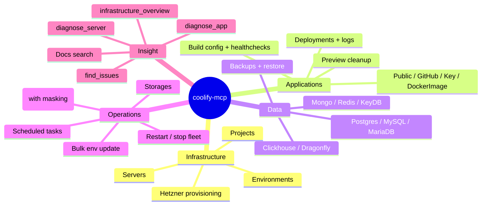

<div style="max-width: 960px; margin: 4rem auto 0; padding: 0 1.5rem;">

## Get running in 60 seconds

For Claude Desktop, Claude Code, Cursor, or any MCP-aware client, add this to your MCP config:

```json
{
  "mcpServers": {
    "coolify": {
      "command": "npx",
      "args": ["-y", "@masonator/coolify-mcp"],
      "env": {
        "COOLIFY_BASE_URL": "https://your-coolify.example.com",
        "COOLIFY_ACCESS_TOKEN": "your-api-token"
      }
    }
  }
}
```

Restart the client. Ask your assistant: _"What's the Coolify version?"_ — it should reply with your instance's version string.

See [Installation](/guide/installation) for per-client details, [Quickstart](/guide/quickstart) for things to try.

## What you can do with it



## What's coming in v3

Three new MCP primitives that reshape the experience:

- **Resources** — subscribe to `coolify://applications/{uuid}` and get pushed updates on status change
- **Tasks** — `deploy` returns immediately with a task ID; client polls or streams progress instead of blocking for minutes
- **Prompts** — `/diagnose-app`, `/cleanup-stale-previews`, `/promote-staging-to-prod` as one-click slash commands
- **Streamable HTTP transport** — host coolify-mcp alongside Coolify itself; each instance is just a URL

[Read the v3 vision →](/roadmap/v3-vision)

## License & contributing

MIT licensed, open contribution. The [contributing guide](/contributing/adding-tools) walks through adding a tool from scratch — types → client → MCP layer → tests → CHANGELOG. The maintainer typically responds within a day or two.

</div>
