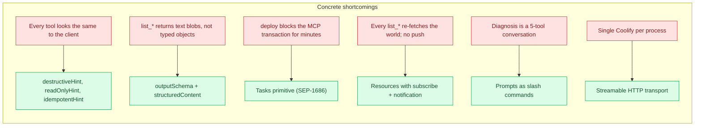
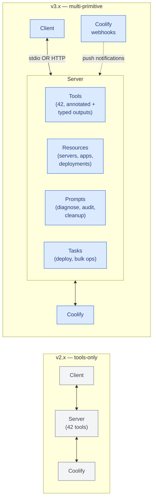
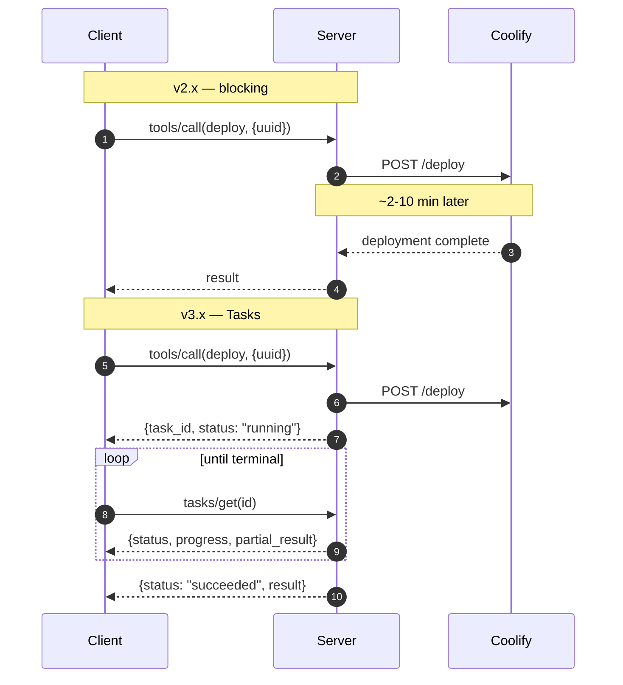
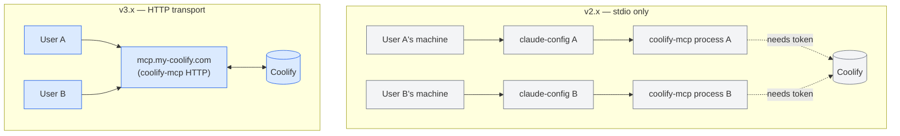
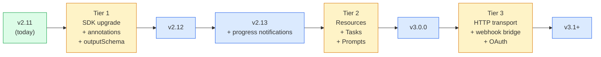

# v3 vision

> Status: **draft** — living document. Pushback / suggestions welcome via [GitHub Issues](https://github.com/StuMason/coolify-mcp/issues).

## The one-liner

> v3 reframes coolify-mcp from "RPC to a remote API" into **a live, subscribable, scriptable surface on your infrastructure.**

Concretely that means three MCP primitives we don't use today — **Resources**, **Tasks**, **Prompts** — plus a transport option (**streamable HTTP**) that makes the multi-Coolify use case ([#164](https://github.com/StuMason/coolify-mcp/issues/164)) trivial, and a layer of polish (**annotations + outputSchema**) that should ship as a v2.12 quick-win regardless.

## What's wrong with v2.x



## How v3 reshapes the architecture



## Per-primitive design

### Resources

**Shape:**

| URI                                         | What                          |
| ------------------------------------------- | ----------------------------- |
| `coolify://servers`                         | List of servers               |
| `coolify://servers/{uuid}`                  | Single server detail          |
| `coolify://applications`                    | List of apps                  |
| `coolify://applications/{uuid}`             | Single app detail             |
| `coolify://applications/{uuid}/deployments` | Recent deployments for an app |
| `coolify://deployments/{uuid}`              | Single deployment detail      |
| `coolify://projects`                        | Projects                      |
| `coolify://databases/{uuid}`                | Database detail               |

**Why this is a win:**

- Clients (especially Claude Desktop) can auto-attach resources to context. The user doesn't have to say "list my apps" — the app list is already in context.
- Resources support **subscribe + notification**. The client can subscribe to `coolify://applications/{uuid}` and be notified when status changes — perfect for "deploy this, then tell me when it's healthy."
- Resources are _application-controlled_, not _model-controlled_. The model can browse them but doesn't autonomously invoke side-effects.

**Migration impact:** `list_*` and `get_*` tools stay (some clients don't yet support resources). They become wrappers over the resource read. No removals.

### Tasks (SEP-1686)

**Shape:** the long-running tools get a `taskSupport: 'optional'` or `'required'` declaration. Calling them returns a task ID immediately. The client polls or streams progress.



**Candidates:** `deploy`, `redeploy_project`, `bulk_env_update`, `restart_project_apps`, `stop_all_apps`, `database_backup`.

**Why this is a win:**

- The user can do other things while a deployment runs.
- Progress updates ("building... 30%... 60%... healthy") become possible.
- Retry semantics — transient failures don't waste the user's hour.

**Migration impact:** sync calls still work (declaring `taskSupport` as `optional` lets old clients ignore it). New clients get the streaming UX automatically.

### Prompts

**Candidates:**

| Slash command              | What it does                                                     |
| -------------------------- | ---------------------------------------------------------------- |
| `/diagnose-app`            | Interactive walkthrough of why an app is unhealthy               |
| `/audit-security`          | Lists env vars with weak secrets, expiring certs, unused tokens  |
| `/cleanup-stale-previews`  | Finds PR preview deployments older than N days, offers to delete |
| `/setup-environment-clone` | Duplicates prod into staging with sensible defaults              |
| `/promote-staging-to-prod` | Env-var diff + deploy                                            |
| `/onboard-new-app`         | Interactive app creation with sensible defaults                  |

**Why this is a win:**

- Prompts are _user-invoked_ (slash commands in most clients). They surface as discoverable workflows in the client UI instead of requiring the user to phrase the right natural-language request.
- They compose multiple tools into deterministic flows, reducing the "did the LLM remember to also..." cognitive load.

**Migration impact:** purely additive.

### Tool annotations (Tier-1 quick win)

**Shape:** add to every tool descriptor:

```typescript
this.tool('list_applications', '...', schema, handler, {
  title: 'Application: List',
  annotations: {
    readOnlyHint: true,
    openWorldHint: false, // it's our own controlled API
  },
});

this.tool('stop_all_apps', '...', schema, handler, {
  title: 'Stop All Applications (DESTRUCTIVE)',
  annotations: {
    destructiveHint: true,
    idempotentHint: true,
  },
});
```

| Annotation              | What clients do with it                         |
| ----------------------- | ----------------------------------------------- |
| `readOnlyHint: true`    | Skip confirmation prompts                       |
| `destructiveHint: true` | Strong confirmation required                    |
| `idempotentHint: true`  | Safe to retry on transient failures             |
| `openWorldHint: false`  | Server has full knowledge of effects (our case) |

**Migration impact:** purely additive. Clients ignore annotations they don't understand.

### `outputSchema` + `structuredContent` (Tier-1 quick win)

**Shape:** every `list_*` and `get_*` tool declares the response shape:

```typescript
this.tool('list_applications', '...', schema, handler, {
  outputSchema: {
    type: 'object',
    properties: {
      applications: {
        type: 'array',
        items: {
          type: 'object',
          properties: {
            uuid: { type: 'string' },
            name: { type: 'string' },
            status: { type: 'string' },
          },
          required: ['uuid', 'name', 'status'],
        },
      },
    },
  },
});
```

Responses include both `content` (text, for human readability) and `structuredContent` (typed JSON, for the LLM to chain reliably).

**Why this is a win:** the LLM no longer has to re-parse `list_*` output as text to find a uuid. It gets `structuredContent.applications[0].uuid` directly. Reduces malformed tool calls when chaining (currently a non-trivial source of failures).

### Streamable HTTP transport

**Shape:** the same coolify-mcp binary can run as `coolify-mcp --transport=stdio` (current default) or `coolify-mcp --transport=http --port=8080`. In HTTP mode, the MCP server listens for JSON-RPC over `POST /` and streams responses via SSE.



**Why this is a win:** a Coolify operator runs one coolify-mcp instance per Coolify, on the same machine, exposes a URL gated by the existing Coolify auth — any teammate connects with the URL. No token-sharing, no local process spawning. Resolves [#164](https://github.com/StuMason/coolify-mcp/issues/164) elegantly: each instance is just a URL.

## v2 vs v3 side-by-side

| Concern               | v2.x (today)                | v3.x (proposed)                          |
| --------------------- | --------------------------- | ---------------------------------------- |
| Tool annotations      | None                        | All tools annotated                      |
| Tool output shape     | Text blobs                  | Text + typed `structuredContent`         |
| Long-running ops      | Block the transaction       | Return task ID, stream progress          |
| Coolify entity access | Per-call `list_*` / `get_*` | Subscribe-able resources                 |
| Workflows             | Multi-tool conversations    | Prompts as slash commands                |
| Transport             | stdio only                  | stdio + streamable HTTP                  |
| Multi-Coolify         | Multiple processes          | One URL per Coolify                      |
| State freshness       | Snapshot per call           | Push notifications via webhook bridge    |
| Auth                  | Static token env var        | Token _or_ OAuth (when Coolify ships it) |

## Phasing



## Open questions

1. **OAuth vs token.** Should v3 require OAuth from day one for the HTTP transport, or accept tokens too? Coolify's OAuth story is still maturing.
2. **Resource granularity.** Should `coolify://servers` be a single subscribe target, or one per server? The latter scales better but is chattier.
3. **Tasks adoption pace.** The Tasks primitive is still flagged experimental in the spec. Do we ship v3 with it, or wait for it to go stable?
4. **Backwards compat.** v3 is a major bump — but how aggressive on removing v2 tools? Recommendation: keep all v2 tools through the v3.x line, document them as "legacy, prefer resource X" where applicable, remove in v4.
5. **Webhook → notification bridge.** Does this need a daemon mode (the MCP process running continuously rather than per-session)? That's a much bigger architecture change.

## What's next

1. **Stu approves the broad shape** (this doc)
2. We open an issue per primitive, with the design quoted from here, for community discussion
3. Pick a starting primitive — likely **`outputSchema` + annotations** as a Tier-1 quick win
4. Land that in v2.12.x, validate the pattern
5. Tier-2 primitives land progressively, v3.0.0 ships when **Resources + Tasks + Prompts** are all in
